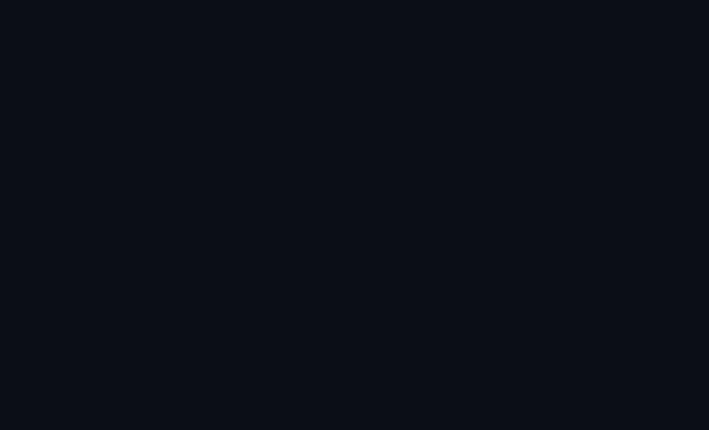

# MMM-FamilyAgenda

A [MagicMirror²](https://magicmirror.builders/) module that turns the standard `calendar`
module into a **compact family agenda**: upcoming events grouped by day, each with a
semantic emoji, the participants (person avatars derived from the calendar name) and —
optionally — the **weather at the event's location**.



It does **not** fetch calendars itself. Add the built-in `calendar` module with your feeds;
this module listens to its `CALENDAR_EVENTS` broadcast.

## Installation

```bash
cd ~/MagicMirror/modules
git clone https://github.com/<your-user>/MMM-FamilyAgenda
```

```js
{
  module: "MMM-FamilyAgenda",
  position: "top_left",
  config: {
    title: "Agenda",
    people: {
      "Alice": { emoji: "👩", color: "#f43f5e" },
      "Bob":   { emoji: "🧑", color: "#3b82f6" }
    },
    calendarAliases: { "Alice Sport": "Alice" }
  }
}
```

The avatar shown per event is chosen from the event's `calendarName` (mapped through
`calendarAliases`, then looked up in `people`).

## Optional: weather per event

Set `showWeather: true` and provide an OpenWeather `appid`. Events with a `LOCATION` in the
next 5 days are geocoded via OpenStreetMap Nominatim and get a small weather icon + temperature.
Bring your own API key — none is bundled.

## Configuration options

| Option                | Type   | Default                         | Description                                             |
| --------------------- | ------ | ------------------------------- | ------------------------------------------------------- |
| `title`               | string | `"Agenda"`                      | Header title.                                           |
| `people`              | object | `{}`                            | `name → { emoji, color }` avatars, keyed by calendar name. |
| `calendarAliases`     | object | `{}`                            | Map a calendar name onto a person.                     |
| `holidayOwner`        | string | `"Holiday"`                     | Owner used for holiday/vacation events.                |
| `defaultOwner`        | string | `"Family"`                      | Owner when no calendar name matches.                   |
| `maximumNumberOfDays` | number | `30`                            | Horizon in days.                                       |
| `maximumEventDays`    | number | `10`                            | Max distinct day groups.                               |
| `maximumEntries`      | number | `18`                            | Max events shown.                                      |
| `locale`              | string | `null`                          | Locale for dates/times (null = browser default).       |
| `showWeather`         | bool   | `false`                         | Show weather at each event's location.                 |
| `appid`               | string | `""`                            | OpenWeather API key (only needed for weather).         |

## License

MIT © Andreas Göpfert
